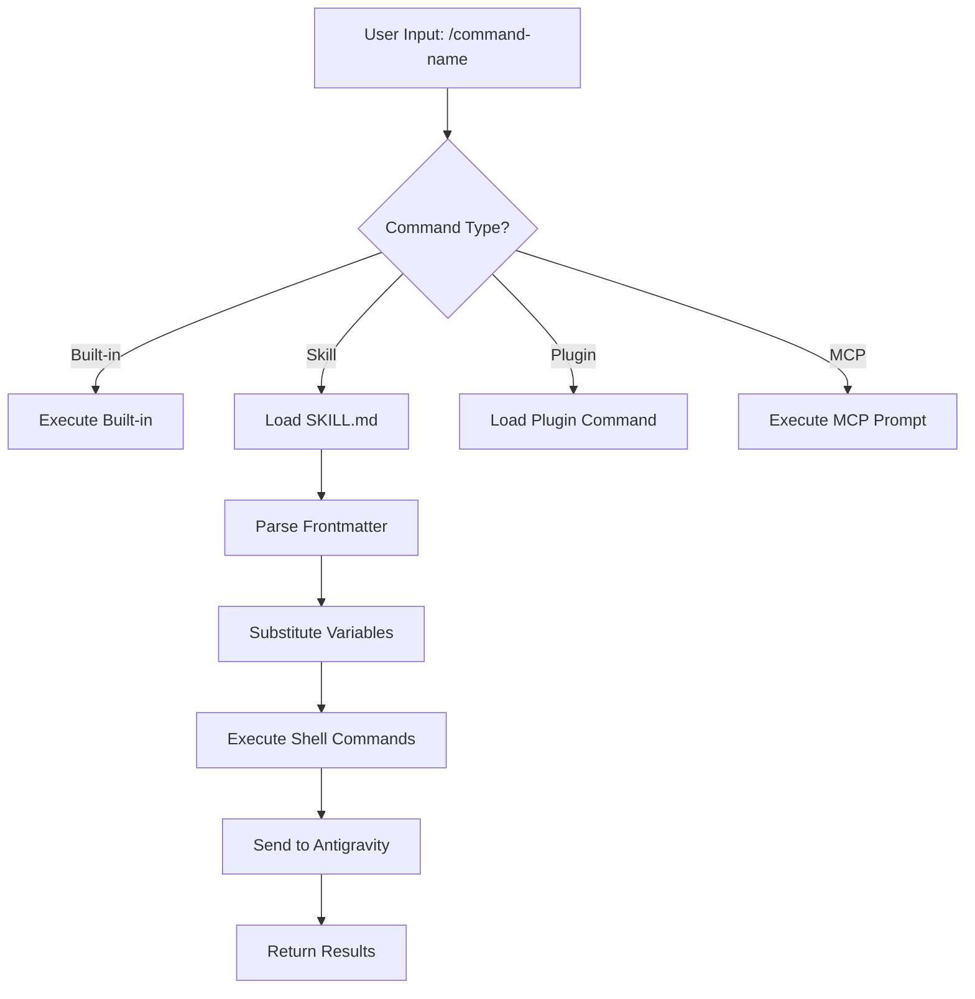
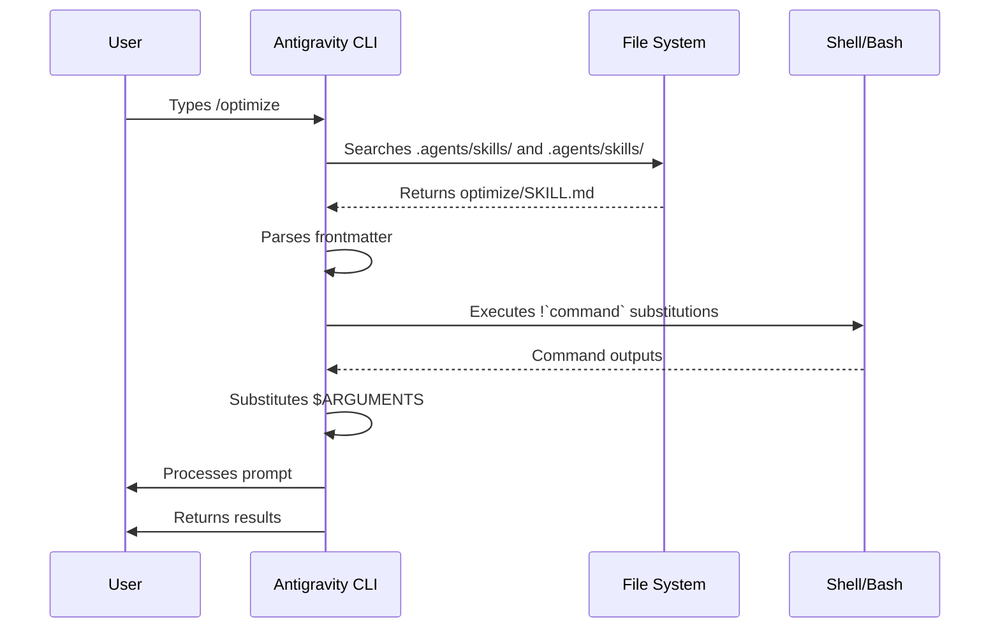

<picture>
  <source media="(prefers-color-scheme: dark)" srcset="../resources/logos/agy-howto-logo-dark.svg">
  
</picture>

# Slash Commands

## Overview

Slash commands are shortcuts that control Antigravity's behavior during an interactive session. They come in several types:

- **Built-in commands**: Provided by Antigravity CLI (`/help`, `/clear`, `/model`)
- **Skills**: User-defined commands created as `SKILL.md` files (`/optimize`, `/pr`)
- **Plugin commands**: Commands from installed plugins (`/frontend-design:frontend-design`)
- **MCP prompts**: Commands from MCP servers (`/mcp__github__list_prs`)

> **Note**: Custom slash commands have been merged into skills. Files in `.agents/skills/` still work, but skills (`.agents/skills/`) are now the recommended approach. Both create `/command-name` shortcuts. See the [Skills Guide](../03-skills/) for the full reference.

## Built-in Commands Reference

Built-in commands are shortcuts for common actions. There are **25 built-in commands** and **5 bundled skills** available. Type `/` in Antigravity CLI to see the full list, or type `/` followed by any letters to filter.

| Command | Alias | Category | Purpose |
|:---|:---|:---|:---|
| `/add-dir <path>` | — | Utilities | Add a directory path to the active workspace. |
| `/agents` | — | Tools & Tasks | Open the Agent Manager Panel to switch agents/subagents. |
| `/artifact` | — | Tools & Tasks | Open the Artifact Review Panel. |
| `/btw <query>` | — | Utilities | Ask a side question in the background without polluting context. |
| `/clear` | `/new` | Utilities | Clear terminal and reset conversation context. |
| `/config` | `/settings` | Configurations | Open the interactive Settings Editor Overlay. |
| `/context` | — | Utilities | Open the context usage visualization panel. |
| `/copy` | — | Utilities | Copy the last agent response to the clipboard. |
| `/credits` | — | Account | View remaining G1 credits and purchase links. |
| `/diff` | — | Utilities | Open the Interactive Diff Viewer for changes. |
| `/exit` | `/quit` | Core | Close the TUI session and return to shell. |
| `/fast` | — | Configurations | Enable fast mode (bypass reasoning plans). |
| `/feedback` | — | Utilities | Open the feedback submission panel. |
| `/fork` | `/branch` | Conversations | Clone the current thread into a new parallel session. |
| `/help` | — | Utilities | Open the help panel. |
| `/hooks` | — | Tools & Tasks | Browse active script hooks. |
| `/keybindings` | — | Configurations | Open the Keyboard Shortcut Editor. |
| `/logout` | — | Account | Disconnect profile and purge tokens. |
| `/usage` | `/quota` | Quota | Monitor resource consumption and model quotas. |
| `/resume` | `/switch` | Conversations | List and switch/resume previous conversation logs. |
| `/rewind` | `/undo` | Conversations | Roll back the conversation history and code state. |
| `/skills` | — | Tools & Tasks | List available skills. |
| `/goal <statement>`| — | Task Execution | Run the agent in high-autonomy background mode until task completion. |
| `/schedule` | — | Task Execution | Create a one-time timer or a recurring cron schedule. |
| `/grill-me` | — | Task Execution | Prompt the agent to ask clarifying questions before starting. |

### Bundled Skills

These skills ship with Antigravity CLI and are invoked like slash commands:

| Skill | Purpose |
|-------|---------|
| `/batch <instruction>` | Orchestrate large-scale parallel changes using worktrees |
| `/agy-api` | Load Antigravity API reference for project language |
| `/dataviz` | Chart and dashboard design guidance with a runnable color-palette validator (v2.1.198) |
| `/debug [description]` | Enable debug logging |
| `/loop [interval] <prompt>` | Run prompt repeatedly on interval |
| `/code-review [effort]` | Review the current diff for correctness bugs at a chosen effort level (e.g. `/code-review high`). Originally absorbed `/simplify` in v2.1.146, but `/simplify` returned as a distinct command in v2.1.154 |
| `/simplify` | Run a cleanup-only review (reuse / simplification / efficiency / altitude) and apply the fixes; does **not** hunt for bugs — use `/code-review` for that. Briefly an alias of `/code-review --fix` (v2.1.152), it became cleanup-only in v2.1.154 |

### Deprecated Commands

| Command | Status |
|---------|--------|
| `/output-style` | Deprecated since v2.1.73 |
| `/fork` | Renamed to `/branch` (alias still works, v2.1.77) |
| `/pr-comments` | Removed in v2.1.91 — ask Antigravity directly to view PR comments |
| `/vim` | Removed in v2.1.92 — use /config → Editor mode |

### Recent Changes

- `/fork` renamed to `/branch` with `/fork` kept as alias (v2.1.77)
- `/output-style` deprecated (v2.1.73)
- `/review <pr>` now uses the same review engine as `/code-review medium` (v2.1.186)
- `/effort` command added; `max` level available on Opus 4.6+ (originally Opus 4.6-only)
- `/voice` command added for push-to-talk voice dictation
- `/schedule` command added for creating/managing scheduled tasks
- `/color` command added for prompt bar customization
- /pr-comments removed in v2.1.91 — ask Antigravity directly to view PR comments
- /vim removed in v2.1.92 — use /config → Editor mode instead
- /ultraplan added for browser-based plan review and execution
- /powerup added for interactive feature lessons
- /sandbox added for toggling sandbox mode
- `/model` picker now shows human-readable labels (e.g., "Sonnet 4.6") instead of raw model IDs
- `/resume` supports `/continue` alias
- MCP prompts are available as `/mcp__<server>__<prompt>` commands (see [MCP Prompts as Commands](#mcp-prompts-as-commands))
- `/team-onboarding` added for auto-generating teammate ramp-up guides (v2.1.101)
- `/tui` command added for flicker-free fullscreen TUI rendering (v2.1.110)
- `/focus` command added for focus view toggle; `Ctrl+O` now only toggles verbose transcript (v2.1.110)
- `/recap` command added to manually trigger session context recap (v2.1.108)
- `/undo` added as alias for `/rewind` (v2.1.108)
- `/proactive` added as alias for `/loop` (v2.1.105)
- `/effort` gained interactive arrow-key slider and new `xhigh` level between `high` and `max`; default effort raised to `xhigh` for Opus 4.7 plans (v2.1.111). On Opus 4.8 the default is `high` (v2.1.154)
- `/ultrareview` added for comprehensive cloud-based multi-agent code review (v2.1.111)
- `/less-permission-prompts` added to analyze Bash/MCP tool calls and reduce permission prompts via an allowlist in `.agents/settings.json` (v2.1.111)
- Auto mode no longer requires the `--enable-auto-mode` flag for Max subscribers on Opus 4.7 (v2.1.112)
- `/goal` added — session-level completion condition that Antigravity works toward across turns; live overlay shows elapsed time, turn count, and token usage (v2.1.139)
- `/scroll-speed` added — tune mouse-wheel scroll speed of the TUI live-preview pane; persists per-machine (v2.1.139)
- `/reload-skills` added — re-scan skill directories without restarting the session (v2.1.152)
- `/model` now saves the selected model as the default for new sessions; press `s` for session-only (keybinding `modelPicker:setAsDefault` → `modelPicker:thisSessionOnly`) (v2.1.153)
- `/workflows` added — view running and completed dynamic workflow runs (v2.1.154)
- `/simplify` returned as a distinct cleanup-only review command (reuse / simplification / efficiency / altitude), separate from `/code-review`'s bug hunt (v2.1.154)

### `/goal` — Session-Level Completion Condition

> **New in v2.1.139**

Use `/goal` to register a completion condition for the current session. Antigravity works toward it across turns, and an overlay panel shows elapsed time, turn count, and tokens used. Clear it with `/goal clear`. Works in interactive mode, `agy -p`, and Remote Control.

```
User: /goal Migrate the payments service from REST to gRPC and get the integration tests passing.
Antigravity: Goal registered. I'll work toward this until you clear it.
[Goal panel: ⏱ 0s · turns 0 · tokens 0]

User: start by listing the REST endpoints
Antigravity: [does the work, panel updates]
```

### `/team-onboarding` — Teammate Ramp-Up Guide

> **New in v2.1.101**

Use `/team-onboarding` to generate a teammate ramp-up guide from your project's local Antigravity CLI usage. The command inspects your `MEMORY.md`, installed skills, subagents, hooks, and recent workflows, then produces an onboarding document that helps new developers become productive quickly.

It's a built-in command — nothing to install.

**Usage:**

```bash
agy /team-onboarding
```

The generated guide summarizes:

- Project purpose and key conventions from [`MEMORY.md`](../02-memory/README.md)
- Available [skills](../03-skills/README.md) and when they are auto-invoked
- Configured [subagents](../04-subagents/README.md) and their responsibilities
- [Hooks](../06-hooks/README.md) that run on common events
- Common workflows newcomers should know about

**Availability:** Shipped in Antigravity CLI v2.1.101 (April 11, 2026).

## Custom Commands (Now Skills)

Custom slash commands have been **merged into skills**. Both approaches create commands you can invoke with `/command-name`:

| Approach | Location | Status |
|----------|----------|--------|
| **Skills (Recommended)** | `.agents/skills/<name>/SKILL.md` | Current standard |
| **Legacy Commands** | `.agents/skills/<name>.md` | Still works |

If a skill and a command share the same name, the **skill takes precedence**. For example, when both `.agents/skills/review.md` and `.agents/skills/review/SKILL.md` exist, the skill version is used.

### Migration Path

Your existing `.agents/skills/` files continue to work without changes. To migrate to skills:

**Before (Command):**
```
.agents/skills/optimize.md
```

**After (Skill):**
```
.agents/skills/optimize/SKILL.md
```

### Why Skills?

Skills offer additional features over legacy commands:

- **Directory structure**: Bundle scripts, templates, and reference files
- **Auto-invocation**: Antigravity can trigger skills automatically when relevant
- **Invocation control**: Choose whether users, Antigravity, or both can invoke
- **Subagent execution**: Run skills in isolated contexts with `context: fork`
- **Progressive disclosure**: Load additional files only when needed

### Creating a Custom Command as a Skill

Create a directory with a `SKILL.md` file:

```bash
mkdir -p .agents/skills/my-command
```

**File:** `.agents/skills/my-command/SKILL.md`

```yaml
---
name: my-command
description: What this command does and when to use it
---

# My Command

Instructions for Antigravity to follow when this command is invoked.

1. First step
2. Second step
3. Third step
```

### Frontmatter Reference

| Field | Purpose | Default |
|-------|---------|---------|
| `name` | Command name (becomes `/name`) | Directory name |
| `description` | Brief description (helps Antigravity know when to use it) | First paragraph |
| `argument-hint` | Expected arguments for auto-completion | None |
| `allowed-tools` | Tools the command can use without permission | Inherits |
| `model` | Specific model to use | Inherits |
| `disable-model-invocation` | If `true`, only user can invoke (not Antigravity) | `false` |
| `user-invocable` | If `false`, hide from `/` menu | `true` |
| `context` | Set to `fork` to run in isolated subagent | None |
| `agent` | Agent type when using `context: fork` | `general-purpose` |
| `hooks` | Skill-scoped hooks (PreToolUse, PostToolUse, Stop) | None |

### Arguments

Commands can receive arguments:

**All arguments with `$ARGUMENTS`:**

```yaml
---
name: fix-issue
description: Fix a GitHub issue by number
---

Fix issue #$ARGUMENTS following our coding standards
```

Usage: `/fix-issue 123` → `$ARGUMENTS` becomes "123"

**Individual arguments with `$0`, `$1`, etc.:**

```yaml
---
name: review-pr
description: Review a PR with priority
---

Review PR #$0 with priority $1
```

Usage: `/review-pr 456 high` → `$0`="456", `$1`="high"

`${AGY_PROJECT_DIR}` resolves to the absolute path of the project root (v2.1.196).

### Dynamic Context with Shell Commands

Execute bash commands before the prompt using `` !`command` ``:

```yaml
---
name: commit
description: Create a git commit with context
allowed-tools: Bash(git *)
---

## Context

- Current git status: !`git status`
- Current git diff: !`git diff HEAD`
- Current branch: !`git branch --show-current`
- Recent commits: !`git log --oneline -5`

## Your task

Based on the above changes, create a single git commit.
```

### File References

Include file contents using `@`:

```markdown
Review the implementation in @src/utils/helpers.js
Compare @src/old-version.js with @src/new-version.js
```

## Plugin Commands

Plugins can provide custom commands:

```
/plugin-name:command-name
```

Or simply `/command-name` when there are no naming conflicts.

**Examples:**
```bash
/frontend-design:frontend-design
/commit-commands:commit
```

## MCP Prompts as Commands

MCP servers can expose prompts as slash commands:

```
/mcp__<server-name>__<prompt-name> [arguments]
```

**Examples:**
```bash
/mcp__github__list_prs
/mcp__github__pr_review 456
/mcp__jira__create_issue "Bug title" high
```

### MCP Permission Syntax

Control MCP server access in permissions:

- `mcp__github` - Access entire GitHub MCP server
- `mcp__github__*` - Wildcard access to all tools
- `mcp__github__get_issue` - Specific tool access

## Command Architecture



## Command Lifecycle



## Available Commands in This Folder

These example commands can be installed as skills or legacy commands.

### 1. `/optimize` - Code Optimization

Analyzes code for performance issues, memory leaks, and optimization opportunities.

**Usage:**
```
/optimize
[Paste your code]
```

### 2. `/pr` - Pull Request Preparation

Guides through PR preparation checklist including linting, testing, and commit formatting.

**Usage:**
```
/pr
```

**Screenshot:**


### 3. `/generate-api-docs` - API Documentation Generator

Generates comprehensive API documentation from source code.

**Usage:**
```
/generate-api-docs
```

### 4. `/commit` - Git Commit with Context

Creates a git commit with dynamic context from your repository.

**Usage:**
```
/commit [optional message]
```

### 5. `/push-all` - Stage, Commit, and Push

Stages all changes, creates a commit, and pushes to remote with safety checks.

**Usage:**
```
/push-all
```

**Safety Checks:**
- Secrets: `.env*`, `*.key`, `*.pem`, `credentials.json`
- API Keys: Detects real keys vs. placeholders
- Large files: `>10MB` without Git LFS
- Build artifacts: `node_modules/`, `dist/`, `__pycache__/`

### 6. `/doc-refactor` - Documentation Restructuring

Restructures project documentation for clarity and accessibility.

**Usage:**
```
/doc-refactor
```

### 7. `/setup-ci-cd` - CI/CD Pipeline Setup

Implements pre-commit hooks and GitHub Actions for quality assurance.

**Usage:**
```
/setup-ci-cd
```

### 8. `/unit-test-expand` - Test Coverage Expansion

Increases test coverage by targeting untested branches and edge cases.

**Usage:**
```
/unit-test-expand
```

## Installation

### As Skills (Recommended)

Copy to your skills directory:

```bash
# Create skills directory
mkdir -p .agents/skills

# For each command file, create a skill directory
for cmd in optimize pr commit; do
  mkdir -p .agents/skills/$cmd
  cp 01-slash-commands/$cmd.md .agents/skills/$cmd/SKILL.md
done
```

### As Legacy Commands

Copy to your commands directory:

```bash
# Project-wide (team)
mkdir -p .agents/commands
cp 01-slash-commands/*.md .agents/skills/

# Personal use
mkdir -p ~/.gemini/antigravity-cli/commands
cp 01-slash-commands/*.md ~/.gemini/antigravity-cli/skills/
```

## Creating Your Own Commands

### Skill Template (Recommended)

Create `.agents/skills/my-command/SKILL.md`:

```yaml
---
name: my-command
description: What this command does. Use when [trigger conditions].
argument-hint: [optional-args]
allowed-tools: Bash(npm *), Read, Grep
---

# Command Title

## Context

- Current branch: !`git branch --show-current`
- Related files: @package.json

## Instructions

1. First step
2. Second step with argument: $ARGUMENTS
3. Third step

## Output Format

- How to format the response
- What to include
```

### User-Only Command (No Auto-Invocation)

For commands with side effects that Antigravity shouldn't trigger automatically:

```yaml
---
name: deploy
description: Deploy to production
disable-model-invocation: true
allowed-tools: Bash(npm *), Bash(git *)
---

Deploy the application to production:

1. Run tests
2. Build application
3. Push to deployment target
4. Verify deployment
```

## Best Practices

| Do | Don't |
|------|---------|
| Use clear, action-oriented names | Create commands for one-time tasks |
| Include `description` with trigger conditions | Build complex logic in commands |
| Keep commands focused on single task | Hardcode sensitive information |
| Use `disable-model-invocation` for side effects | Skip the description field |
| Use `!` prefix for dynamic context | Assume Antigravity knows current state |
| Organize related files in skill directories | Put everything in one file |

## Troubleshooting

### Command Not Found

**Solutions:**
- Check file is in `.agents/skills/<name>/SKILL.md` or `.agents/skills/<name>.md`
- Verify the `name` field in frontmatter matches expected command name
- Restart Antigravity CLI session
- Run `/help` to see available commands

### Command Not Executing as Expected

**Solutions:**
- Add more specific instructions
- Include examples in the skill file
- Check `allowed-tools` if using bash commands
- Test with simple inputs first

### Skill vs Command Conflict

If both exist with the same name, the **skill takes precedence**. Remove one or rename it.

## Related Guides

- **[Skills](../03-skills/)** - Full reference for skills (auto-invoked capabilities)
- **[Memory](../02-memory/)** - Persistent context with MEMORY.md
- **[Subagents](../04-subagents/)** - Delegated AI agents
- **[Plugins](../07-plugins/)** - Bundled command collections
- **[Hooks](../06-hooks/)** - Event-driven automation

## Additional Resources

- [Official Interactive Mode Documentation](https://code.agy.com/docs/en/interactive-mode) - Built-in commands reference
- [Official Skills Documentation](https://code.agy.com/docs/en/skills) - Complete skills reference
- [CLI Reference](https://code.agy.com/docs/en/cli-reference) - Command-line options

---

**Last Updated**: July 11, 2026
**Antigravity CLI Version**: 2.1.206
**Sources**:
- https://code.agy.com/docs/en/slash-commands
- https://code.agy.com/docs/en/skills
- https://code.agy.com/docs/en/interactive-mode
- https://code.agy.com/docs/en/changelog
- https://code.agy.com/docs/en/commands
- https://code.agy.com/docs/en/model-config
- https://antigravity.google/changelog
- https://antigravity.google/docs/cli/reference
**Compatible Models**: Antigravity Sonnet 5, Antigravity Sonnet 4.6, Antigravity Opus 4.8, Antigravity Haiku 4.5

*Part of the [Antigravity How To](../) guide series*
